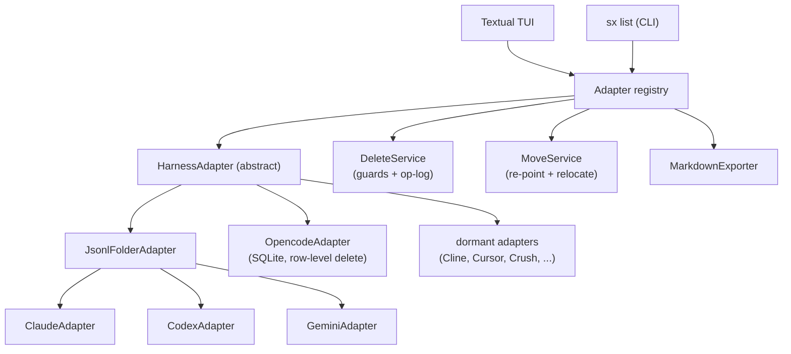

# sx — session explorer for AI coding harnesses

A terminal TUI that gathers the chat sessions every AI coding harness leaves on
your machine — **Claude Code**, **Codex**, **Gemini CLI**, and more — into one
browsable, groupable, *deletable* view. Think of it as a terminal-native
alternative to Claude Code UI, covering every harness at once.

> **Status:** functional. Browsing, search, grouping, moving a project to a new
> directory, permanent deletion with Markdown export, and orphan cleanup all work
> across Claude, Codex, Gemini, and opencode.

## Why

Each harness scatters sessions in its own format and location: Claude under
`~/.claude/projects/<encoded-cwd>/`, Codex in a date tree under
`~/.codex/sessions/`, Gemini as mutation logs under `~/.gemini/tmp/<hash>/`, and
opencode as rows in a shared SQLite database. Over time these pile up alongside
orphaned folders pointing at projects you deleted long ago. `sx` reads them all,
lets you scroll any transcript, and permanently removes the ones you no longer
want.

## Features

- **Unified browser** — sessions grouped by harness, then by project.
- **Scrollable transcripts** — normalized rendering across every harness.
- **Move a project** — relocated a repo? Re-point its sessions at the new
  directory in every harness at once, or have `sx` move the directory too.
  Reversible, unlike deletion.
- **Orphan detection** — finds session folders whose project is gone, plus
  stray temp files, and reports *why* each is flagged.
- **Permanent delete with guardrails** — dry-run preview, typed confirmation
  for bulk operations, a path allowlist, an active-session guard, and an
  append-only deletion log. No accidental `rm -rf`.
- **Pre-delete Markdown export** — optionally archive a transcript to Markdown
  before removing it (also available as a standalone export action).
- **Forward-looking** — harnesses you have not installed yet appear grayed out
  and light up the moment their session store shows up on disk.

## Supported harnesses

| Harness | Status | Store |
|---|---|---|
| Claude Code | ✅ verified | `~/.claude/projects/<encoded-cwd>/<id>.jsonl` |
| Codex | ✅ verified | `~/.codex/sessions/YYYY/MM/DD/rollout-*.jsonl` |
| Gemini CLI | ✅ verified | `~/.gemini/tmp/<hash>/chats/session-*.jsonl` |
| opencode | ✅ verified | `~/.local/share/opencode/opencode.db` (SQLite) |
| Qwen Code | 🔎 dormant | Gemini-fork layout |
| Continue | 🔎 dormant | `~/.continue/sessions/*.json` |
| Goose | 🔎 dormant | `~/.local/share/goose/sessions/` |
| Cline | 🧩 dormant | `~/.cline/data/workspaces/<id>/` |
| Cursor | 🧩 dormant | `~/.cursor/` (SQLite) |
| Crush | 🧩 dormant | SQLite |

✅ verified on a real machine · 🔎 format known · 🧩 needs probing once installed

## Run it

You need [`uv`](https://docs.astral.sh/uv/). Pick one of the two ways below.

### Option A — run straight from GitHub, no install (`uvx`)

`uvx` fetches, builds, and runs `sx` in a throwaway environment — nothing is
added to your PATH:

```bash
uvx --from git+https://github.com/junxit/agentic-session-explorer.git sx
```

Typing that every time is a mouthful, so add an `sx` alias to your shell. The
alias also sets `SX_NO_UPDATE_CHECK=1`, because `uvx` already pulls the latest
build — the in-app "update available" prompt would be redundant here.

**zsh** — append to `~/.zshrc`:

```bash
alias sx='SX_NO_UPDATE_CHECK=1 uvx --from git+https://github.com/junxit/agentic-session-explorer.git sx'
```

**bash** — append to `~/.bashrc` (Linux) or `~/.bash_profile` (macOS):

```bash
alias sx='SX_NO_UPDATE_CHECK=1 uvx --from git+https://github.com/junxit/agentic-session-explorer.git sx'
```

**fish** — append to `~/.config/fish/config.fish`:

```fish
alias sx 'env SX_NO_UPDATE_CHECK=1 uvx --from git+https://github.com/junxit/agentic-session-explorer.git sx'
```

Then reload (`source ~/.zshrc`, etc.) and run `sx`, `sx list`, `sx --version` —
arguments pass straight through the alias.

`uvx` caches builds, so a plain run may reuse a recent one. To force the newest
commit, add `--refresh` to the alias's command, or pin a released tag with
`...explorer.git@v0.2.0`.

### Option B — install as a tool (recommended for regular use)

This puts a persistent `sx` on your PATH:

```bash
uv tool install git+https://github.com/junxit/agentic-session-explorer.git
```

(From a local clone, `uv tool install .` works too.)

**Upgrade:**

```bash
uv tool upgrade sx
# or force the very latest commit on main:
uv tool install --force git+https://github.com/junxit/agentic-session-explorer.git
```

**Uninstall:**

```bash
uv tool uninstall sx
```

When you run an installed `sx` interactively, it checks GitHub **at most once a
day** for a newer release and prints a one-line notice (the TUI shows a toast).
The check is cached, times out fast, fails silently, and never blocks startup.
Turn it off with `--no-update-check` or by exporting `SX_NO_UPDATE_CHECK=1`.

## Usage

```bash
sx              # launch the interactive TUI
sx list         # list every discovered session as plain text
sx move         # re-point a project's sessions at a new directory
sx harnesses    # show all known harnesses and their status
sx version      # show the installed version and check for a newer one
sx update       # show (or, with --run, execute) the upgrade command
```

### Keys (in the TUI)

| Key | Action |
|---|---|
| `↑`/`↓` or `j`/`k` | Move the selection |
| `enter` | Open the highlighted session's transcript |
| `g` / `G` | Jump to top / bottom of a transcript |
| `b` | Cycle grouping: **project → date → recency** |
| `/` | Filter by title or project (live) |
| `e` | Export the highlighted session to Markdown |
| `m` | Re-point this project's sessions at a directory you already moved |
| `M` | Move the project directory itself, then re-point its sessions |
| `d` | Permanently delete the highlighted session (with preview) |
| `o` | Open the orphan-cleanup screen |
| `r` | Re-scan all harness stores |
| `q` | Quit |

A session written within the last 90 seconds is flagged `● LIVE`; deleting one
requires typing `DELETE` to confirm. Bulk orphan deletion requires typing
`DELETE <n>`. Exports default to `./session-exports/` and never overwrite an
existing file. Every deletion is appended to `./sx-deletions.log` (set
`SX_LOG_FILE` to keep one log across directories).

## Moving a project

When you relocate a project directory, every harness keeps pointing at the old
path. `sx` shows those sessions grouped under a directory that no longer exists,
flags them as orphans, and the only thing it used to offer was deletion.

Two keys fix that, and `sx move` does the same from the shell:

```bash
# the directory has already been moved by hand — just re-point the sessions
sx move --from ~/src/old-place/proj --to ~/src/new-place/proj --dry-run
sx move --from ~/src/old-place/proj --to ~/src/new-place/proj

# nothing has moved yet — move the directory too, then re-point the sessions
sx move --from ~/src/old-place/proj --to ~/src/new-place/proj --relocate
```

One move covers **every** harness holding sessions at that path. What each of
them needs is different:

| Harness | What a move changes |
|---|---|
| Claude Code | Re-points the `cwd` recorded throughout each transcript, then moves the project folder to the name the new path encodes to — carrying `memory/` and every session's `<session-id>/` sidecar |
| Codex | Re-points the `cwd` in the `session_meta` and every `turn_context`; files stay in their date tree |
| Gemini CLI | Rewrites the `.project_root` marker and re-keys `~/.gemini/projects.json` |
| opencode | Updates the session's `directory` and `path` columns, and its workspace |

A few properties worth knowing:

- **It is reversible.** Running the inverse move restores the previous state
  byte for byte, and the op-log records both endpoints so the old path is still
  readable afterwards.
- **Only the structural field is touched.** A path mentioned inside tool output
  or your own prose is historical record and is left exactly as written.
- **Subdirectories come along.** A session recorded in `proj/docs` moves with
  `proj`; a sibling named `proj-old` does not.
- **Nothing is ever overwritten.** If you have already run the harness at the
  new path, the stores are merged and any colliding name is refused.
- **Claude's own project settings are opt-in.** `--claude-config` (or the
  checkbox in the TUI) also re-points the `~/.claude.json` `projects` entry —
  the trust decision, `allowedTools`, MCP servers — and `~/.claude/history.jsonl`.
  Without it a moved project is treated as brand new by Claude Code. It is off
  by default because those files belong to a harness that may be running.
- **`--relocate` is guarded.** It refuses a destination that already holds
  anything, a destination inside the source, your home directory, and any
  directory containing a harness store. A cross-filesystem move is disclosed as
  the copy-then-delete it really is.

## Architecture



Every adapter normalizes its harness into the same `Session` and `Message`
types, so the transcript viewer, the exporter, and the delete and move flows are
each written once and work for all harnesses — present and future. Most harnesses
store one file per session; opencode keeps all sessions as rows in a shared
SQLite database, so its adapter subclasses `HarnessAdapter` directly and deletes
a session's rows (and its `session_diff` sidecar) without ever touching the
database file or other sessions. Its shared `log/` files are left alone.

## Development

```bash
uv sync --extra dev
uv run sx list
uv run pytest
```

### Releasing

The update check compares the installed version against the latest GitHub
**release** (falling back to the highest `vX.Y.Z` tag). To publish an update:

1. Bump `version` in `pyproject.toml` and `__version__` in `src/sx/__init__.py`.
2. Commit, then tag and release:

   ```bash
   git tag v0.2.0 && git push --tags
   gh release create v0.2.0 --generate-notes
   ```

Installed copies will then prompt their users to upgrade.

## Safety

`sx` deletes permanently — there is no trash or undo. A move is reversible, but
it still rewrites files a harness may be using. Everything below exists so that
the confirmation you see is the whole truth about what is about to happen:

- **The preview is complete.** It lists the files to be removed, any non-file
  work (a database-backed harness reports the row count), what a folder actually
  contains — including nested transcripts and `memory/` files — and anything the
  guard will refuse.
- **Failures are never reported as success.** A refused deletion says so, keeps
  its row, and leaves the file on disk.
- **A store-root allowlist** blocks any target outside a harness's own
  directory, and refuses a store root itself.
- **Live sessions need a typed `DELETE`.** Liveness comes from the harness (file
  mtime, or the database column that tracks activity); when it can't be
  determined the session is treated as live rather than assumed safe.
- **Bulk actions need a typed `DELETE <n>`**, with the count derived from the
  same list that will be deleted.
- **Export never overwrites.** Colliding archive names get a suffix, so
  "export before deleting" cannot destroy the archive it just made.
- **Untrusted transcript text can't drive your terminal.** Control sequences are
  replaced with visible glyphs (`␛`, `␇`) in both the TUI and exported Markdown.
- **Rewrites are atomic and never truncate.** A move writes a new copy beside
  the original and swaps it in, copies through any line it cannot parse
  byte-for-byte, and abandons the write entirely if the harness appended to the
  file while it was in progress.
- **Every deletion and move is logged** to `./sx-deletions.log` (owner-only), and
  a logging failure is surfaced rather than swallowed. A move records both
  endpoints, which is what makes it undoable after the fact. The log is
  per-directory; set `SX_LOG_FILE` to collect every operation in one place.

Sessions whose project lives on an unmounted volume are treated as *unavailable*,
not deleted, so unplugging a drive never turns real transcripts into cleanup
candidates.

## License

MIT
