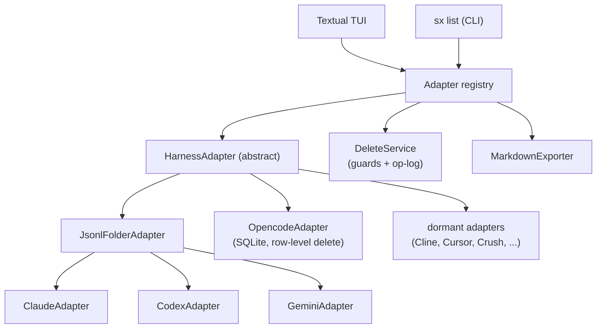

# sx — session explorer for AI coding harnesses

A terminal TUI that gathers the chat sessions every AI coding harness leaves on
your machine — **Claude Code**, **Codex**, **Gemini CLI**, and more — into one
browsable, groupable, *deletable* view. Think of it as a terminal-native
alternative to Claude Code UI, covering every harness at once.

> **Status:** functional. Browsing, search, grouping, permanent deletion with
> Markdown export, and orphan cleanup all work across Claude, Codex, Gemini, and
> opencode.

## Why

Each harness scatters sessions in its own format and location: Claude under
`~/.claude/projects/<encoded-cwd>/`, Codex in a date tree under
`~/.codex/sessions/`, Gemini as mutation logs under `~/.gemini/tmp/<hash>/`, and
opencode as rows in a shared SQLite database. Over time these pile up alongside
orphaned folders pointing at projects you deleted long ago. `sx` reads them all,
lets you scroll any transcript, and permanently removes the ones you no longer
want.

## Features

- **Unified browser** — sessions grouped by harness, then by project.
- **Scrollable transcripts** — normalized rendering across every harness.
- **Orphan detection** — finds session folders whose project is gone, plus
  stray temp files, and reports *why* each is flagged.
- **Permanent delete with guardrails** — dry-run preview, typed confirmation
  for bulk operations, a path allowlist, an active-session guard, and an
  append-only deletion log. No accidental `rm -rf`.
- **Pre-delete Markdown export** — optionally archive a transcript to Markdown
  before removing it (also available as a standalone export action).
- **Forward-looking** — harnesses you have not installed yet appear greyed out
  and light up the moment their session store shows up on disk.

## Supported harnesses

| Harness | Status | Store |
|---|---|---|
| Claude Code | ✅ verified | `~/.claude/projects/<encoded-cwd>/<id>.jsonl` |
| Codex | ✅ verified | `~/.codex/sessions/YYYY/MM/DD/rollout-*.jsonl` |
| Gemini CLI | ✅ verified | `~/.gemini/tmp/<hash>/chats/session-*.jsonl` |
| opencode | ✅ verified | `~/.local/share/opencode/opencode.db` (SQLite) |
| Qwen Code | 🔎 dormant | Gemini-fork layout |
| Continue | 🔎 dormant | `~/.continue/sessions/*.json` |
| Goose | 🔎 dormant | `~/.local/share/goose/sessions/` |
| Cline | 🧩 dormant | `~/.cline/data/workspaces/<id>/` |
| Cursor | 🧩 dormant | `~/.cursor/` (SQLite) |
| Crush | 🧩 dormant | SQLite |

✅ verified on a real machine · 🔎 format known · 🧩 needs probing once installed

## Run it

You need [`uv`](https://docs.astral.sh/uv/). Pick one of the two ways below.

### Option A — run straight from GitHub, no install (`uvx`)

`uvx` fetches, builds, and runs `sx` in a throwaway environment — nothing is
added to your PATH:

```bash
uvx --from git+https://github.com/junxit/agentic-session-explorer.git sx
```

Typing that every time is a mouthful, so add an `sx` alias to your shell. The
alias also sets `SX_NO_UPDATE_CHECK=1`, because `uvx` already pulls the latest
build — the in-app "update available" prompt would be redundant here.

**zsh** — append to `~/.zshrc`:

```bash
alias sx='SX_NO_UPDATE_CHECK=1 uvx --from git+https://github.com/junxit/agentic-session-explorer.git sx'
```

**bash** — append to `~/.bashrc` (Linux) or `~/.bash_profile` (macOS):

```bash
alias sx='SX_NO_UPDATE_CHECK=1 uvx --from git+https://github.com/junxit/agentic-session-explorer.git sx'
```

**fish** — append to `~/.config/fish/config.fish`:

```fish
alias sx 'env SX_NO_UPDATE_CHECK=1 uvx --from git+https://github.com/junxit/agentic-session-explorer.git sx'
```

Then reload (`source ~/.zshrc`, etc.) and run `sx`, `sx list`, `sx --version` —
arguments pass straight through the alias.

`uvx` caches builds, so a plain run may reuse a recent one. To force the newest
commit, add `--refresh` to the alias's command, or pin a released tag with
`...explorer.git@v0.2.0`.

### Option B — install as a tool (recommended for regular use)

This puts a persistent `sx` on your PATH:

```bash
uv tool install git+https://github.com/junxit/agentic-session-explorer.git
```

(From a local clone, `uv tool install .` works too.)

**Upgrade:**

```bash
uv tool upgrade sx
# or force the very latest commit on main:
uv tool install --force git+https://github.com/junxit/agentic-session-explorer.git
```

**Uninstall:**

```bash
uv tool uninstall sx
```

When you run an installed `sx` interactively, it checks GitHub **at most once a
day** for a newer release and prints a one-line notice (the TUI shows a toast).
The check is cached, times out fast, fails silently, and never blocks startup.
Turn it off with `--no-update-check` or by exporting `SX_NO_UPDATE_CHECK=1`.

## Usage

```bash
sx              # launch the interactive TUI
sx list         # list every discovered session as plain text
sx harnesses    # show all known harnesses and their status
sx version      # show the installed version and check for a newer one
sx update       # show (or, with --run, execute) the upgrade command
```

### Keys (in the TUI)

| Key | Action |
|---|---|
| `↑`/`↓` or `j`/`k` | Move the selection |
| `enter` | Open the highlighted session's transcript |
| `g` / `G` | Jump to top / bottom of a transcript |
| `m` | Cycle grouping: **project → date → recency** |
| `/` | Filter by title or project (live) |
| `e` | Export the highlighted session to Markdown |
| `d` | Permanently delete the highlighted session (with preview) |
| `o` | Open the orphan-cleanup screen |
| `r` | Re-scan all harness stores |
| `q` | Quit |

A session written within the last 90 seconds is flagged `● LIVE`; deleting one
requires typing `DELETE` to confirm. Bulk orphan deletion requires typing
`DELETE <n>`. Exports default to `./session-exports/`; every deletion is
appended to `./sx-deletions.log`.

## Architecture



Every adapter normalizes its harness into the same `Session` and `Message`
types, so the transcript viewer, the exporter, and the delete flow are each
written once and work for all harnesses — present and future. Most harnesses
store one file per session; opencode keeps all sessions as rows in a shared
SQLite database, so its adapter subclasses `HarnessAdapter` directly and deletes
a session's rows (and its `session_diff` sidecar) without ever touching the
database file or other sessions. Its shared `log/` files are left alone.

## Development

```bash
uv sync --extra dev
uv run sx list
uv run pytest
```

### Releasing

The update check compares the installed version against the latest GitHub
**release** (falling back to the highest `vX.Y.Z` tag). To publish an update:

1. Bump `version` in `pyproject.toml` and `__version__` in `src/sx/__init__.py`.
2. Commit, then tag and release:

   ```bash
   git tag v0.2.0 && git push --tags
   gh release create v0.2.0 --generate-notes
   ```

Installed copies will then prompt their users to upgrade.

## Safety

`sx` deletes permanently — there is no trash or undo. To compensate, deletion
is gated behind a preview, typed confirmation for bulk actions, a guard that
refuses to touch anything outside known harness store roots, and a guard that
refuses to delete a session that is currently being written. Every deletion is
appended to `sx-deletions.log`.

## License

MIT
