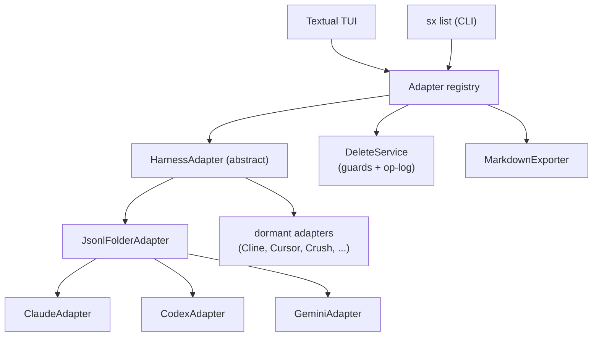

# sx — session explorer for AI coding harnesses

A terminal TUI that gathers the chat sessions every AI coding harness leaves on
your machine — **Claude Code**, **Codex**, **Gemini CLI**, and more — into one
browsable, groupable, *deletable* view. Think of it as a terminal-native
alternative to Claude Code UI, covering every harness at once.

> **Status:** functional. Browsing, search, grouping, permanent deletion with
> Markdown export, and orphan cleanup all work across Claude, Codex, and Gemini.

## Why

Each harness scatters sessions in its own format and location: Claude under
`~/.claude/projects/<encoded-cwd>/`, Codex in a date tree under
`~/.codex/sessions/`, Gemini as mutation logs under `~/.gemini/tmp/<hash>/`.
Over time these pile up alongside orphaned folders pointing at projects you
deleted long ago. `sx` reads them all, lets you scroll any transcript, and
permanently removes the ones you no longer want.

## Features

- **Unified browser** — sessions grouped by harness, then by project.
- **Scrollable transcripts** — normalized rendering across every harness.
- **Orphan detection** — finds session folders whose project is gone, plus
  stray temp files, and reports *why* each is flagged.
- **Permanent delete with guardrails** — dry-run preview, typed confirmation
  for bulk operations, a path allowlist, an active-session guard, and an
  append-only deletion log. No accidental `rm -rf`.
- **Pre-delete Markdown export** — optionally archive a transcript to Markdown
  before removing it (also available as a standalone export action).
- **Forward-looking** — harnesses you have not installed yet appear greyed out
  and light up the moment their session store shows up on disk.

## Supported harnesses

| Harness | Status | Store |
|---|---|---|
| Claude Code | ✅ verified | `~/.claude/projects/<encoded-cwd>/<id>.jsonl` |
| Codex | ✅ verified | `~/.codex/sessions/YYYY/MM/DD/rollout-*.jsonl` |
| Gemini CLI | ✅ verified | `~/.gemini/tmp/<hash>/chats/session-*.jsonl` |
| Qwen Code | 🔎 dormant | Gemini-fork layout |
| Continue | 🔎 dormant | `~/.continue/sessions/*.json` |
| Goose | 🔎 dormant | `~/.local/share/goose/sessions/` |
| opencode | 🔎 dormant | `~/.local/share/opencode/` |
| Cline | 🧩 dormant | `~/.cline/data/workspaces/<id>/` |
| Cursor | 🧩 dormant | `~/.cursor/` (SQLite) |
| Crush | 🧩 dormant | SQLite |

✅ verified on a real machine · 🔎 format known · 🧩 needs probing once installed

## Install

```bash
uv tool install .
```

This puts the `sx` command on your PATH.

## Usage

```bash
sx              # launch the interactive TUI
sx list         # list every discovered session as plain text
sx harnesses    # show all known harnesses and their status
```

### Keys (in the TUI)

| Key | Action |
|---|---|
| `↑`/`↓` or `j`/`k` | Move the selection |
| `enter` | Open the highlighted session's transcript |
| `g` / `G` | Jump to top / bottom of a transcript |
| `m` | Cycle grouping: **project → date → recency** |
| `/` | Filter by title or project (live) |
| `e` | Export the highlighted session to Markdown |
| `d` | Permanently delete the highlighted session (with preview) |
| `o` | Open the orphan-cleanup screen |
| `r` | Re-scan all harness stores |
| `q` | Quit |

A session written within the last 90 seconds is flagged `● LIVE`; deleting one
requires typing `DELETE` to confirm. Bulk orphan deletion requires typing
`DELETE <n>`. Exports default to `./session-exports/`; every deletion is
appended to `./sx-deletions.log`.

## Architecture



Every adapter normalizes its harness into the same `Session` and `Message`
types, so the transcript viewer, the exporter, and the delete flow are each
written once and work for all harnesses — present and future.

## Development

```bash
uv sync --extra dev
uv run sx list
uv run pytest
```

## Safety

`sx` deletes permanently — there is no trash or undo. To compensate, deletion
is gated behind a preview, typed confirmation for bulk actions, a guard that
refuses to touch anything outside known harness store roots, and a guard that
refuses to delete a session that is currently being written. Every deletion is
appended to `sx-deletions.log`.

## License

MIT
